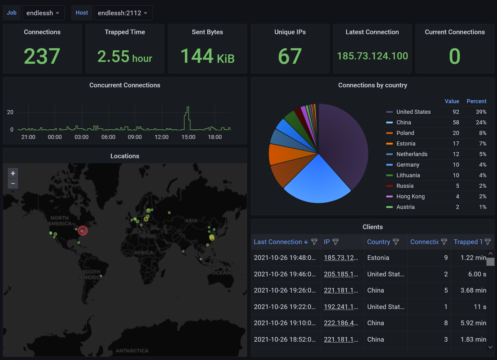

# endlessh-go

Golang implementation of [endlessh](https://nullprogram.com/blog/2019/03/22/).

## Introduction

Endlessh is a great idea that not only blocks the brute force SSH attacks, but also wastes attackers time as a kind of counter-attack. Besides trapping the attackers, I also want to virtualize the Geolocations and other statistics of the sources of attacks. Unfortunately the wonderful [C implementation of endlessh](https://github.com/skeeto/endlessh) only provides text based log, but I do not like the solution that writing extra scripts to parse the log outputs, then exporting the results to a dashboard, because it would introduce extra layers in my current setup and it would depend on the format of the text log file rather than some structured data. Thus I create this golang implementation of endlessh to export [Prometheus](https://prometheus.io/) metrics and a [Grafana](https://grafana.com/) dashboard to virtualize them.

If you want a dashboard of sources of attacks and do not mind the endlessh server, besides trapping the attackers, does extra things including: translating IP to Geohash, exporting Prometheus metrics, and using more memory (about 10MB), this is the solution for you.

## Getting Started

Clone the repo then build from source:

```
go build .
./endlessh-go
```

Alternatively, you can use docker:

```
sudo docker run -d shizunge/endlessh-go
```

It listens to port `2222` by default.

If you want log like the [C implementation](https://github.com/skeeto/endlessh), you need to set both CLI arguments `-logtostderr` and `-v=1`, then the log will go to the stderr. You can set different log destinations via CLI arguments.

## Usage

Usage of `./endlessh-go`

* -alsologtostderr
  * log to standard error as well as files
* -conn_type string
  * Connection type. Possible values are tcp, tcp4, tcp6 (default "tcp")
* -enable_prometheus
  * Enable prometheus
* -geoip_supplier string
  * Supplier to obtain Geohash of IPs. Possible values are "off", "ip-api", "freegeoip" (default "off")
* -host string
  * Listening address (default "0.0.0.0")
* -interval_ms int
  * Message millisecond delay (default 1000)
* -line_length int
  * Maximum banner line length (default 32)
* -log_backtrace_at value
  * when logging hits line file:N, emit a stack trace
* -log_dir string
  * If non-empty, write log files in this directory
* -logtostderr
  * log to standard error instead of files
* -max_clients int
  * Maximum number of clients (default 4096)
* -port string
  * Listening port (default "2222")
* -prometheus_entry string
  * Entry point for prometheus (default "metrics")
* -prometheus_port string
  * The port for prometheus (default "2112")
* -stderrthreshold value
  * logs at or above this threshold go to stderr
* -v value
  * log level for V logs
* -vmodule value
  * comma-separated list of pattern=N settings for file-filtered logging

## Metrics

This golang implementation exports the following Prometheus metrics.

| Metric                               | Type  | Description  |
|--------------------------------------|-------|--------------|
| endlessh_client_open_count_total     | count | Total number of clients that tried to connect to this host. |
| endlessh_client_closed_count_total   | count | Total number of clients that stopped connecting to this host. |
| endlessh_sent_bytes_total            | count | Total bytes sent to clients that tried to connect to this host. |
| endlessh_trapped_time_seconds_total  | count | Total seconds clients spent on endlessh. |
| endlessh_client_open_count           | count | Number of connections of clients. <br> Labals: <br> <ul><li> `ip`: IP of the client </li> <li>  `country`: Country of the IP </li> <li>  `location`: Country, Region, and City </li> <li>  `geohash`: Geohash of the location </li></ul> |
| endlessh_client_trapped_time_seconds | count | Seconds a client spends on endlessh. <br> Labals: <br> <ul><li>  `ip`: IP of the client </li></ul> |

The metrics is off by default, you can turn it via the CLI argument `-enable_prometheus`.

It listens to port `2112` and entry point is `/metrics` by default. The port and entry point can be changed via CLI arguments.

The endlessh-go server stores the geohash of attackers as a label on `endlessh_client_open_count`, which is also off by default. You can turn it on via the CLI argument `-geoip_supplier`. The endlessh-go uses service from either [ip-api](https://ip-api.com/) or [freegeoip](https://freegeoip.live/), which may enforce a query rate and limit commercial use. Visit their website for their terms and policies.

## Dashboard



The dashboard requires Grafana 8.2.

You can import the dashboard from Grafana.com using ID [15156](https://grafana.com/grafana/dashboards/15156)

The IP addresses are clickable and link you to the [ARIN](https://www.arin.net/) database.
